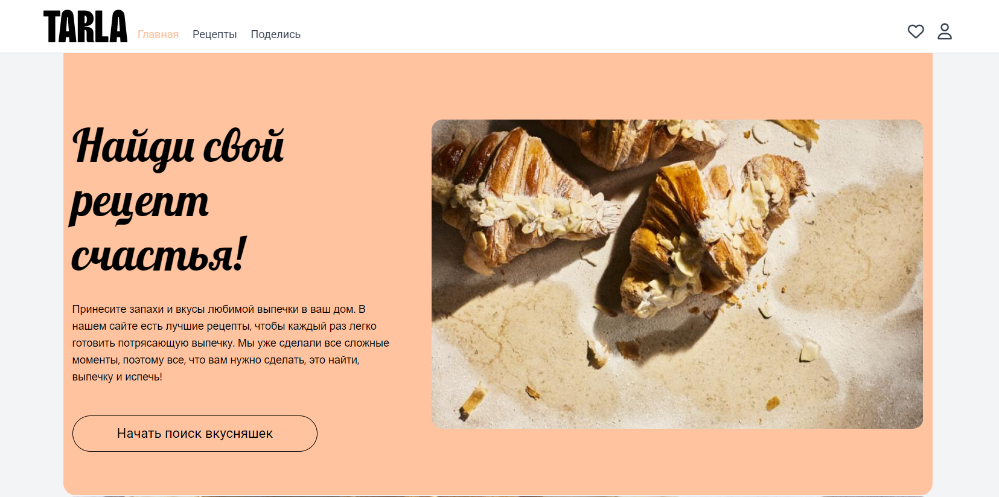

README.md

# 🍳 QA Tech — Платформа для обмена рецептами

Приложение, где пользователи могут делиться своими рецептами, просматривать рецепты других и сохранять понравившиеся в избранное.

Проект создан с акцентом на простоту интерфейса, удобство взаимодействия и отзывчивый дизайн.

---

## 🚀 Технологии

---

## 📁 Структура проекта

| src |
|     | ── assets/ | # Изображения и статические ресурсы |
|     | ── components/ | # Повторно используемые компоненты (Auth, Header, Card, Footer и т.д.) |
|     | ── pages/ | # Основные страницы приложения (Home, Recipes, Favorites, Share) |
|     | ── redux/ | # Состояние приложения (store, actions, reducers) |
|     | ── App.js | # Корневой компонент приложения |
|     | ── index.js | # Точка входа |
|     | ── index.css | # Tailwind стили |

---

## 🧰 Команды

| Команда | Назначение |
|----------|------------|
| `npm start` | Запуск проекта в режиме разработки |

---

## 🚀 Основной функционал
- 👨‍🍳 Публикация собственных рецептов через удобную форму
- ❤️ Добавление рецептов в избранное
- 🔍 Просмотр и фильтрация рецептов других пользователей
- 📱 Адаптивный интерфейс на всех устройствах

---

## 🧩 Превью интерфейса

---

## ✨ Автор

**Лугинов Дьулустаан**  
Frontend Developer
📫 Telegram: [@JulustaanL](https://t.me/JulustaanL)

---